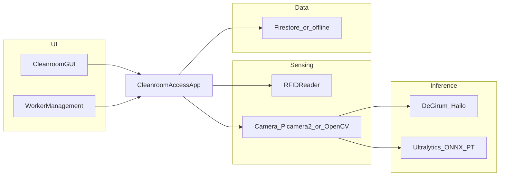

# Cleanroom Access System

Integrated workstation for **cleanroom-style access control**: workers present an **RFID-tagged gown**, the system checks **gown wash / lifecycle rules** in **Firebase Firestore** (or offline mode), verifies **personal protective equipment (PPE)** with a **camera + YOLO** pipeline (optional **Hailo** acceleration via **DeGirum**), and supports **hand-washing supervision** with optional **face recognition**. A **Tkinter** dashboard drives the operator workflow and record-keeping.

This software is intended for **research, education, and prototyping**. It is **not** a certified safety or medical device; deploy only with appropriate organizational review and privacy safeguards.

**This folder is the publication package** — treat it as the project root when you clone or zip it for GitHub.

---

## Features


| Area                | Description                                                                                                                                                                         |
| ------------------- | ----------------------------------------------------------------------------------------------------------------------------------------------------------------------------------- |
| **RFID**            | Serial reader over UART (`pyserial`); mock mode for development without hardware.                                                                                                   |
| **PPE detection**   | Multi-class detection (e.g. gown, gloves, hairnet, mask) with positive / absent / incomplete labels, per-class confidence and consecutive-frame stability; optional result locking. |
| **Inference**       | Primary path: **DeGirum** + **Hailo** YOLOv11-style zoo (`models/yolov11s.json`, custom post-processor). Fallback: **Ultralytics** + ONNX or `.pt`.                                 |
| **Gown compliance** | Firestore (or in-memory offline) for worker–gown binding, washing records, compliant entries, first-use timestamps, and configurable gown lifetime.                                 |
| **Hand washing**    | Face-presence timing and optional `face_recognition` for worker-specific sessions; quality thresholds from config.                                                                  |
| **GUI**             | Full-screen–capable Tkinter UI, worker management, logs and statistics.                                                                                                             |
| **Security audit**  | Separate security logger for access decisions (`security.py`).                                                                                                                      |


---

## Architecture




| Module                                                         | Role                                                                              |
| -------------------------------------------------------------- | --------------------------------------------------------------------------------- |
| `[app.py](app.py)`                                             | Application orchestration, access state machine, callbacks into detectors and DB. |
| `[gui.py](gui.py)`                                             | Main Tkinter interface and theming.                                               |
| `[worker_management.py](worker_management.py)`                 | Worker / gown administration UI.                                                  |
| `[yolo_detector.py](yolo_detector.py)`                         | Camera capture, Hailo or YOLO inference, PPE rule evaluation.                     |
| `[hand_washing_detector.py](hand_washing_detector.py)`         | Hand-wash flow with face detection / recognition.                                 |
| `[rfid_reader.py](rfid_reader.py)`                             | Non-blocking serial RFID reads with cooldown and mock fallback.                   |
| `[firebase_database.py](firebase_database.py)`                 | Firestore CRUD, offline mirror, gown readiness logic.                             |
| `[config.py](config.py)`                                       | YAML load/validate and defaults for `cleanroom_config.yaml`.                      |
| `[security.py](security.py)`                                   | Security-focused logging helpers.                                                 |
| `[models/HailoDetectionYolo.py](models/HailoDetectionYolo.py)` | Hailo post-processor expected by the DeGirum zoo.                                 |
| `[models/hailo_labels.json](models/hailo_labels.json)`         | Label map for Hailo outputs.                                                      |


---

## Hardware

### Minimum / flexible configuration


| Component                     | Notes                                                                                                                                                                        |
| ----------------------------- | ---------------------------------------------------------------------------------------------------------------------------------------------------------------------------- |
| **Host**                      | **Raspberry Pi** (tested with **Pi 5**); code uses **Picamera2** on Raspberry Pi OS. Desktop dev may use OpenCV webcam paths with mocks enabled.                             |
| **Camera**                    | **Raspberry Pi Camera Module 3 Wide** (or compatible CSI module) via Picamera2; resolution and format in `cleanroom_config.yaml` (example portrait **750×950**, `RGB888`).   |
| **AI accelerator (optional)** | **Raspberry Pi AI Hat+** with **Hailo-8L** (**13 TOPS**), driven through **DeGirum**; see `models/yolov11s.json` and Hailo / DeGirum documentation for runtime and firmware. |
| **RFID**                      | **UHF** reader on **USB** or UART; configure `rfid.port` (Windows: `COMx`; Linux: `/dev/ttyUSB0`, `/dev/ttyACM0`, etc.).                                                     |
| **Display**                   | **Raspberry Pi Touch Display 2** (7-inch, GPIO to Pi) or any monitor; `gui.fullscreen` and `window_size` in YAML (e.g. `720x1280`).                                          |
| **Power**                     | **27 W** (5 V @ 5 A class) supply recommended for Pi 5 + AI Hat + display + peripherals under sustained inference.                                                           |


### Reference integrated deployment (physical integration)

These details describe a **reference** kiosk-style assembly; adapt mounts and clearances to your site.


| Topic                       | Specification                                                                                                                                                                                                                                                                                                                       |
| --------------------------- | ----------------------------------------------------------------------------------------------------------------------------------------------------------------------------------------------------------------------------------------------------------------------------------------------------------------------------------- |
| **Compute**                 | Pi 5 — **quad-core ARM Cortex-A76** for OS, UI, camera pipeline, and CPU fallback inference.                                                                                                                                                                                                                                        |
| **AI runtime**              | **YOLOv11s**-style model with **11 PPE-related classes**; stable decisions use **5 consecutive frames** and **confidence ≥ 0.5** (tunable in YAML).                                                                                                                                                                                 |
| **Model binary**            | Train/export **ONNX**, compile to **HEF** for Hailo; load via DeGirum at runtime (`hailo.enable` in config).                                                                                                                                                                                                                        |
| **Camera module**           | Camera Module 3 Wide — up to **12 MP** stills; **~120°** diagonal FOV for frontal coverage; **phase-detection AF**; wide FOV helps full upper-body framing from a short standoff.                                                                                                                                                   |
| **RFID band**               | **UHF 860–960 MHz**; **textile-embeddable** waterproof tags on gowns; **5-digit numeric** IDs in software; **active** read mode; **100 ms** poll interval; **9600 baud** serial to host; RF power often **12.5–30 dB** adjustable — use **low power** and short range (order of **~30 cm**) to avoid reading multiple tags at once. |
| **Tag placement**           | Consistent location (e.g. **wrist** area) improves read reliability at fixed reader position.                                                                                                                                                                                                                                       |
| **Enclosure**               | Example: **3D-printed ABS** shell (higher **Tg** than PLA for heat under load), **ventilation grilles**, slight **overscale (~101%)** print compensation for fit.                                                                                                                                                                   |
| **Stand**                   | **Aluminium tripod** (example working height **~170 cm**, max extension **~190 cm**) for camera eye line; RFID reader on **rigid bracket**; combined Pi+display+camera may use a padded clamp plus **cable ties** for vibration.                                                                                                    |
| **Laundry logging variant** | Reader **downward** above chute; Pi + display; software can log **one tag per event** (multi-tag is an extension).                                                                                                                                                                                                                  |
| **Hand-wash variant**       | Pi 5 + display + camera only (no Hat/RFID required); optional **rod stand** at **~70°** so the face stays in frame at the sink.                                                                                                                                                                                                     |


---

## Software stack


| Layer                   | Packages / APIs                                                                                                                            |
| ----------------------- | ------------------------------------------------------------------------------------------------------------------------------------------ |
| **Language**            | Python 3 (3.10+ recommended).                                                                                                              |
| **UI**                  | Tkinter (stdlib).                                                                                                                          |
| **Vision**              | `opencv-python-headless`, `Pillow`; `picamera2` on Raspberry Pi OS.                                                                        |
| **ML**                  | `ultralytics`, `degirum`, `numpy`.                                                                                                         |
| **Serial**              | `pyserial`.                                                                                                                                |
| **Config**              | `PyYAML`.                                                                                                                                  |
| **Cloud**               | `firebase-admin` (Firestore).                                                                                                              |
| **Optional biometrics** | `[face_recognition](https://github.com/ageitgey/face_recognition)` (`dlib`; easiest on Pi/Linux). Uncomment in `requirements.txt` if used. |


---

## Machine learning (PPE model)

### Why YOLOv11s (example benchmark)

On a shared custom + public cleanroom-style dataset, **YOLOv11s** vs **YOLOv8s** showed higher mAP and stronger gown/mask precision; YOLOv11s is also **smaller on disk**, which suits edge devices once accelerated.


| Metric                              | YOLOv8s | YOLOv11s    |
| ----------------------------------- | ------- | ----------- |
| [mAP@0.5](mailto:mAP@0.5) (overall) | 0.712   | **0.882**   |
| Precision (Hairnet)                 | 0.921   | 0.924       |
| Precision (Mask)                    | 0.81    | **0.868**   |
| Precision (Gloves)                  | 0.881   | 0.865       |
| Precision (Gown)                    | 0.537   | **0.826**   |
| Inference time (CPU, indicative)    | 90 ms   | 128.4 ms    |
| Model size                          | 13.8 MB | **11.2 MB** |


Hailo offload addresses CPU latency for real-time use.

### Class taxonomy (11 classes)

- Gloves: `Gloves`, `Gloves_Absent`
- Gown: `Gown`, `Gown_Absent`, `Gown_Incomplete`
- Hairnet: `Hairnet`, `Hairnet_Absent`, `Hairnet_Incomplete`
- Mask: `Mask`, `Mask_Absent`, `Mask_Incomplete`

### Dataset and training (typical recipe)

- **Sources**: Custom captures labeled in **Roboflow**, plus **Roboflow Universe** exports for pose/lighting diversity.
- **Preprocess**: Resize **640×640**, auto-orient, adaptive equalization.
- **Augmentations**: rotation ±15°, hue ±15°, brightness ±20%, exposure ±15°, blur ≤1 px, noise ≤1% pixels.
- **Training (example)**: Ultralytics YOLOv11, **25 epochs**, **batch 16**, **SGD**, GPU; export `**best.pt`** → **ONNX** → **HEF** for Hailo.

### Runtime deployment path

1. Train in Ultralytics (PyTorch).
2. Export **ONNX**.
3. Compile **HEF** with Hailo toolchain (quantized graph).
4. Load in app via **DeGirum** (`model_name` / `zoo_path`, `@local` Hailo).
5. On failure, set `hailo.enable: false` or rely on automatic fallback to **Ultralytics** in code.

### Known model limitations (tune data + thresholds)

- **Hairnet incomplete vs absent** can confuse under poor lighting; add targeted training images.  
- **Both hands “gloves absent”** may be inconsistent if labels or occlusion favor one hand; check dataset balance and `min_confidence` / consecutive-frame settings.

---

## Hand washing

- **Duration quality** (defaults in YAML): **0–14 s → bad**; **15–29 s → moderate**; **≥30 s → good** (adjust `hand_washing.quality_thresholds`).  
- **Enrollment**: guided multi-pose captures; encodings stored in `**face_encodings.pkl`** (local only, gitignored).

---

## Optional web dashboard

A separate **single-page** supervisor dashboard (e.g. **Tailwind CSS**, **Chart.js**, **Firebase Authentication**, Firestore `**onSnapshot`** listeners) can mirror the same collections as this app. That frontend is **not included in this package**; add it as another folder or repo if you open-source it.

Firestore collections used by this Python client: `worker_gowns`, `washing_records`, `compliance_records`, `hand_washing_records`.

---

## Configuration (`cleanroom_config.yaml`)


| Section         | Purpose                                                                                                                                                          |
| --------------- | ---------------------------------------------------------------------------------------------------------------------------------------------------------------- |
| `system`        | `debug_mode`, `log_level`, `log_file`, `security_log_file`.                                                                                                      |
| `rfid`          | `port`, `baudrate`, `timeout`, `read_cooldown`, mock flags.                                                                                                      |
| `camera`        | `resolution`, `format`, `enable_mock`, `auto_rotate`.                                                                                                            |
| `yolo`          | `model_path` (ONNX), `fallback_model` (`.pt`), thresholds, mock.                                                                                                 |
| `hailo`         | `enable`, `model_name`, `zoo_path`.                                                                                                                              |
| `ppe_detection` | Per-class `class_names`, `negative_classes`, `incomplete_classes`, `min_confidence`, `required_consecutive_frames`, `required_count`, `enable_locked_mechanism`. |
| `hand_washing`  | Durations, `face_detection_interval`, `quality_thresholds`, mock.                                                                                                |
| `database`      | `credential_path` (local JSON), `enable_offline`.                                                                                                                |
| `gui`           | Window size, theme, message timings, video toggles.                                                                                                              |
| `rules`         | `gown_lifetime_days`, `retry_window_minutes`.                                                                                                                    |


If YAML is missing, `[config.py](config.py)` can generate defaults.

---

## Setup

1. **Use this directory** as the project root (clone the repo and `cd publish`, or publish only this folder as its own repository).
2. **Python environment**
  ```bash
   python -m venv .venv
   .venv\Scripts\activate
   pip install -r requirements.txt
  ```
   On Raspberry Pi OS, `picamera2` is typically available with the desktop/full image.
3. **Firebase (optional; use offline for dry runs)**
  - Create a Firebase project and enable **Firestore**.
  - Service account: Project settings → Service accounts → Generate new private key.
  - Copy `[firebase-credentials.example.json](firebase-credentials.example.json)` to `**firebase-credentials.json`** (gitignored).
  - Set `database.enable_offline: true` to run without cloud.
4. **Models**
  - **Hailo**: Add compiled assets expected by `models/yolov11s.json` and DeGirum. Large weight files (`.hef`, `.onnx`, `.pt`) are **gitignored** by default; place them locally or ship via release assets / Git LFS.
  - **Fallback**: ONNX at `yolo.model_path` or Ultralytics `fallback_model` `.pt`.
5. **Firestore composite indexes**
  Create indexes when the Firebase console prompts, notably:
  - `**compliance_records`**: `serial_number` + `compliant` + order by `timestamp` descending.
  - `**washing_records**`: `serial_number` + order by `wash_timestamp` descending.

---

## Run

```bash
python app.py
```

Entry point: bottom of `[app.py](app.py)` (`CleanroomAccessApp(load_gui=True)`).

---

## Validation and testing (checklist)

- **Worker–gown association**: RFID scan in management UI → Firestore `worker_gowns` document.  
- **Washing log**: record wash → `washing_records` with timestamp.  
- **Hand wash**: register face encodings → timed session → `hand_washing_records`.  
- **Full gate**: RFID passes gown rules → PPE stream → approve/deny UI → `compliance_records`.  
- **PPE stress**: run fully compliant, partially non-compliant, and severely non-compliant wardrobes; compare confidences to configured thresholds.

---

## Security, privacy, and open-source hygiene

- **Never commit** `firebase-credentials.json` or any service account JSON. Only the **example** file belongs in git.
- If a key was ever exposed, **revoke** it in Google Cloud Console and issue a new one. See [Google Cloud key management](https://cloud.google.com/iam/docs/keys-create-delete).
- **Do not commit** `face_encodings.pkl` or production `*.log`; they are gitignored.
- Treat worker names and RFID IDs as **personal / operational data**; comply with GDPR, HIPAA, PDPA, or other local rules as applicable.
- Biometrics and camera imagery require explicit policy, retention limits, and access control in production.

---

## Design notes

- **Vision**: Multi-head PPE taxonomy (present / absent / incomplete) with temporal stabilization in config.  
- **Policy**: Gown readiness uses wash and first-use rules (`check_gown_washed` in `[firebase_database.py](firebase_database.py)`).  
- **Metrics**: mAP and field false-positive rate depend on **your** data and deployment; re-validate after any camera or lighting change.

---

## Regulatory and environmental context

- Cleanroom particle classes are commonly described under **ISO 14644-1**; align your SOPs and validation to your industry (e.g. medical devices, pharma).  
- Edge hardware choices (small SBC + accelerator) can reduce power versus full PC vision racks; digital logs reduce paper waste.  
- Specifications here are **engineering notes**, not a certified device filing. Perform your own qualification, risk analysis, and compliance review before operational use.

---

## Contributing

Issues and pull requests are welcome. Do not commit credentials, logs, or proprietary weight files unless you use Git LFS or separate release artifacts with clear licensing.

---

## License

This project is released under the [MIT License](LICENSE).